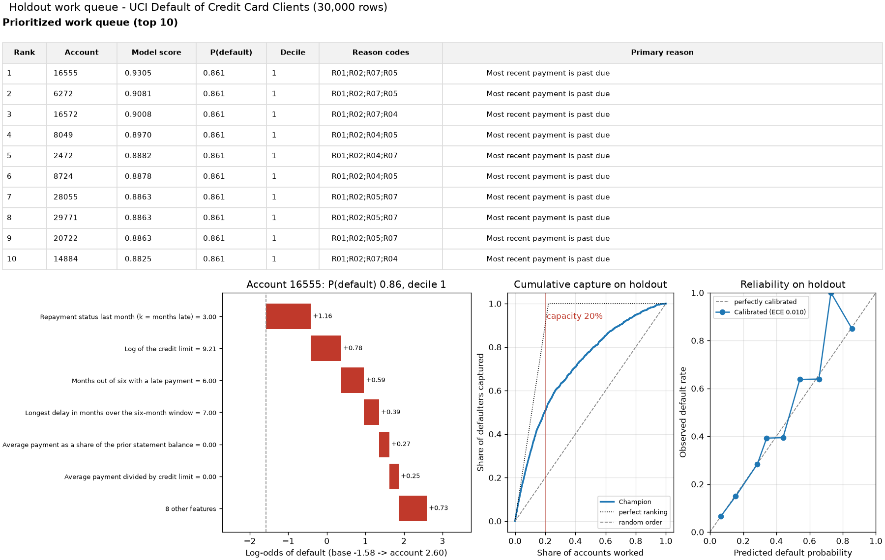
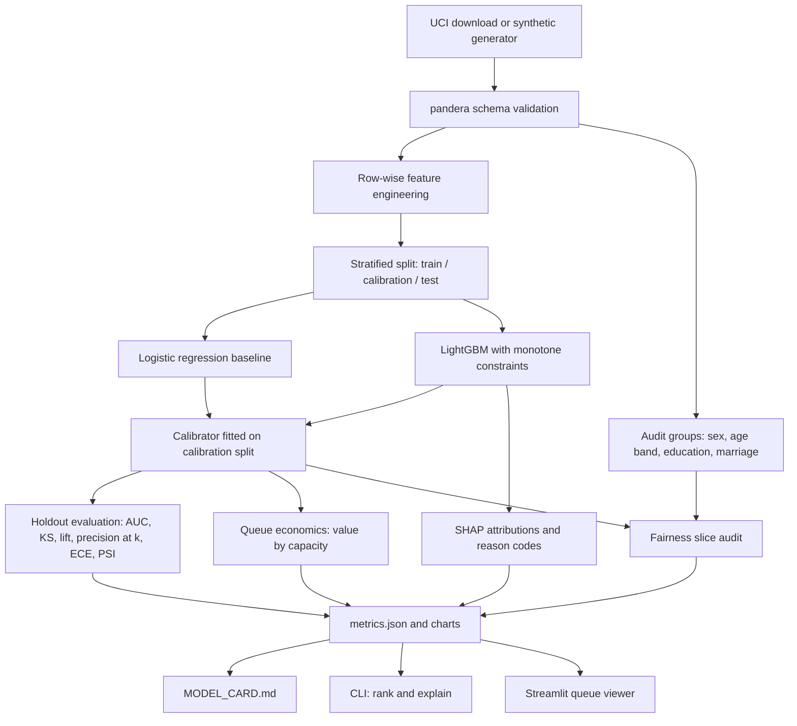

# credit-risk-explain

[](https://github.com/seanmcrae/credit-risk-explain/actions/workflows/ci.yml)
[](https://seanmcrae.github.io/credit-risk-explain/)
[](LICENSE)
[](pyproject.toml)

Decide which card accounts a collections or outreach team works this cycle, and how many: a
calibrated default-risk queue with a reason code on every account and a fairness audit published
with the model.

**Live docs:** [seanmcrae.github.io/credit-risk-explain](https://seanmcrae.github.io/credit-risk-explain/)
(results, fairness findings, [model card](docs/MODEL_CARD.md), [product brief](docs/PRODUCT.md)).

A collections or outreach team can only work a fraction of its accounts each cycle, and every
account it chooses has to be defensible. This repository ranks the queue by calibrated default
risk, attaches adverse-action-style reason codes to every account, picks the queue size from an
explicit cost/benefit matrix, audits the ranking across protected groups, and writes the model
card from the same run. It is built on the public UCI "Default of Credit Card Clients" dataset,
with a seeded synthetic generator so everything runs offline in CI.

On the real UCI data (6,000-account stratified holdout), the monotone-constrained LightGBM ranker
reaches ROC-AUC 0.778 and captures 50.7% of next-month defaulters in the riskiest 20% of the
queue, against 48.2% for the logistic-regression baseline. Calibrated ECE is 0.010. The largest
fairness gap is by age: 60.6% of defaulters aged 18-24 are prioritized versus 42.6% for 55+.

**Numbers** (UCI holdout, from the committed snapshot [docs/results/uci_metrics.json](docs/results/uci_metrics.json))

- **Defaulters captured in the riskiest 20%:** 50.7% for LightGBM vs 48.2% for the
  logistic-regression baseline (ROC-AUC 0.778 vs 0.738)
- **Eval set:** 6,000-account stratified holdout of 30,000 UCI accounts (22.1% default rate)
- **Calibration:** ECE 0.010 after calibration, 0.016 before
- **Expected value at 20% capacity:** 197,200 vs 184,000 for the baseline and 170,800 for working
  every account (illustrative economics from `configs/default.yaml`)
- **Largest fairness gap:** age-band TPR gap 0.180, above the 0.10 target

Latency and serving cost are not measured: scoring is a local batch job, not a service.



## Quickstart

Requires Python 3.11+, [uv](https://docs.astral.sh/uv/) and `make`. One command trains, ranks
and explains on the bundled synthetic sample:

```bash
git clone https://github.com/seanmcrae/credit-risk-explain.git && cd credit-risk-explain && make install demo
```

Then:

```bash
make app            # Streamlit queue viewer on http://localhost:8501
make train-uci      # download UCI data (about 5 MB, checksum-verified, never committed),
                    # train, and regenerate docs/MODEL_CARD.md, docs/img/ and docs/results/
make site           # build the docs site into site/ (offline)
make check          # lint, format check, mypy, tests: the same gates as CI
```

The CLI covers the rest of the workflow:

```bash
uv run credit-rank train    --data data/raw/uci_credit_default.csv --out artifacts/uci
uv run credit-rank evaluate --artifacts artifacts/uci                    # saved holdout metrics
uv run credit-rank evaluate --artifacts artifacts/uci --data new.csv     # score a labeled file, PSI vs holdout
uv run credit-rank rank     --artifacts artifacts/uci --capacity 1200    # writes queue.csv
uv run credit-rank explain 16555 --artifacts artifacts/uci --plot waterfall.png
uv run credit-rank model-card --artifacts artifacts/uci --out docs/MODEL_CARD.md --img-dir img
```

`docker build -t credit-risk-explain . && docker run -p 8501:8501 credit-risk-explain` trains on
the synthetic sample at build time and serves the app.

## Features

- **Two models, one holdout.** Logistic-regression baseline and LightGBM with monotone
  constraints on the risk drivers an analyst would defend, scored on the same stratified test set.
- **Calibrated probabilities.** Laplace-smoothed isotonic (or Platt) calibration fitted on its own
  split, with ECE and reliability curves.
- **Reason codes on every account.** Exact SHAP contributions grouped into seven plain-language
  reasons; only reasons that raise risk are cited.
- **Queue economics.** Expected value by queue size under a configurable contact cost, loss given
  default and cure rate, with the value-maximizing capacity.
- **Fairness audit.** Priority rate, TPR and FPR at capacity, calibration gap and AUC for sex, age
  band, education and marital status, plus a proxy screen that traces the largest gap to features.
- **Generated model card.** Every number in [docs/MODEL_CARD.md](docs/MODEL_CARD.md) is rendered
  from the run's `metrics.json`.
- **CLI, app and docs site.** `credit-rank` for batch use, a Streamlit viewer for analysts, and an
  offline static site deployed to GitHub Pages.

## Example output

`make demo`, captured verbatim. These numbers are from the bundled **synthetic** sample and say
nothing about real-world performance:

```text
$ make demo
Data: bundled synthetic sample (5,000 rows)  rows=5,000  default rate=21.9%
Holdout: 1,000 accounts. Champion: LightGBM
LightGBM             AUC=0.778  PR-AUC=0.550  KS=0.418  lift@D1=3.20  ECE=0.029
                     P@1%=0.700  P@5%=0.760  P@10%=0.700  P@20%=0.555
Logistic regression  AUC=0.786  PR-AUC=0.569  KS=0.460  lift@D1=3.29  ECE=0.028
                     P@1%=0.800  P@5%=0.780  P@10%=0.720  P@20%=0.550
Expected value @ 200 accounts: 32,400   value-maximizing capacity: 600 (60.0%) -> 40,800
Score PSI train vs holdout: 0.0049
Artifacts in artifacts/demo
Queue of 50 of 1,000 accounts -> artifacts/demo/queue.csv
 rank   id  probability  decile    reason_codes                                  primary_reason
    1 2185        0.800       1 R05;R01;R03;R02 Payments are small relative to the balance owed
    2 2165        0.800       1 R05;R01;R03;R02 Payments are small relative to the balance owed
    3 3081        0.800       1 R05;R01;R03;R02 Payments are small relative to the balance owed
    4 3813        0.800       1 R05;R01;R03;R02 Payments are small relative to the balance owed
    5 3153        0.765       1 R05;R01;R03;R02 Payments are small relative to the balance owed
    6 1855        0.750       1 R03;R05;R01;R02        Balance is high relative to credit limit
    7 2646        0.750       1 R03;R01;R05;R02        Balance is high relative to credit limit
    8 3465        0.750       1 R05;R01;R03;R02 Payments are small relative to the balance owed
    9 2341        0.750       1 R01;R05;R03;R02                 Most recent payment is past due
   10 3334        0.750       1 R05;R01;R03;R02 Payments are small relative to the balance owed
Account 2185: P(default)=0.800  decile=1
Reasons:
  R05 Payments are small relative to the balance owed  [payment_to_limit_mean=0.00, +1.66]
  R01 Most recent payment is past due  [pay_status_recent=4.00, +1.01]
  R03 Balance is high relative to credit limit  [utilization_recent=0.90, +0.75]
  R02 Repeated or ongoing delinquency in the last six months  [delinquency_streak=6.00, +0.42]
Largest contributions (log-odds):
  +0.958  Repayment status last month (k = months late) = 4.00
  +0.907  Last statement balance divided by credit limit = 0.90
  +0.724  Average payment divided by credit limit = 0.00
  +0.527  Average payment as a share of the prior statement balance = 0.00
  +0.405  Last payment as a share of the prior statement balance = 0.00
  -0.396  Average six-month balance-to-limit ratio = 0.92
```

## Results

`make train-uci` on the UCI data. Holdout of 6,000 accounts; the full tables are in the
[model card](docs/MODEL_CARD.md).

| Holdout metric (UCI, 6,000 accounts) | LightGBM (champion) | Logistic regression |
|---|---|---|
| ROC-AUC | 0.778 | 0.738 |
| PR-AUC | 0.557 | 0.504 |
| KS | 0.429 | 0.387 |
| Precision in top 5% of queue | 77.0% | 70.7% |
| Defaulters captured in top 20% | 50.7% | 48.2% |
| Calibrated ECE | 0.010 | 0.009 |
| Expected value at 20% capacity (illustrative economics) | 197,200 | 184,000 |

| Fairness at 20% capacity (UCI holdout) | Priority-rate ratio | TPR gap | FPR gap | Max abs calibration gap |
|---|---|---|---|---|
| age_band | 0.65 | 0.180 | 0.077 | 0.029 |
| education | 0.67 | 0.085 | 0.053 | 0.008 |
| marriage | 0.95 | 0.015 | 0.002 | 0.023 |
| sex | 0.94 | 0.036 | 0.016 | 0.011 |

| Cumulative capture | Reliability |
|---|---|
|  |  |

| SHAP summary | Expected value by queue size |
|---|---|
|  |  |


## Where it fails

Read from the UCI holdout snapshot at 20% capacity. The fairness audit drops slices under 100
accounts from its summary; they are listed here because that is where the model is weakest.

**Model and data limits**

| Slice or failure mode | Holdout evidence | What it means |
|---|---|---|
| Age 18-24 vs 55+ | TPR 0.606 vs 0.426 (gap 0.180, target < 0.10); 18-24 calibration gap 0.029 against a 0.03 limit | Young defaulters are worked far more often; traced mainly to credit limit acting as a partial proxy for age |
| Age 55+ | 227 accounts | Smallest audited age slice; no confidence intervals are reported, so its TPR is a noisy point estimate |
| Education: high school | AUC 0.734 (1,014 accounts) vs 0.78-0.79 for university and graduate school | Weakest ranking among the audited slices |
| Education: other/unknown | AUC 0.551, calibration gap 0.099 (82 accounts, excluded from the summary) | Ranking is close to random and probabilities run high for this group |
| Marriage: other/unknown | AUC 0.679, calibration gap 0.072 (75 accounts, excluded from the summary) | Same pattern, smaller |
| Top of the queue | Precision 86.7% in the top 1%, 69.2% in the top 10%, 56.1% in the top 20% | Most of a 20% queue's contacts are still non-defaulters |

**Design and scaffolding limits**

| Limit | Consequence |
|---|---|
| Stratified split of one six-month 2005 snapshot | No out-of-time test; the PSI of 0.002 compares train with a holdout from the same period, so it cannot show drift |
| Baselines are LightGBM vs logistic regression only | No rule-based queue ("2+ months late", "highest balance first") is scored, so the gain over current practice is not measured |
| Champion is fixed in config | On the bundled synthetic sample, logistic regression scores higher (AUC 0.786 vs 0.778) and LightGBM is still the champion |
| Economics are placeholders | Expected value and the value-maximizing capacity move with the contact cost, loss given default and cure rate in config |

**Considered and rejected.** Ranking the queue on the calibrated probability. Isotonic calibration
is a step function, so on the UCI holdout its top level (0.861) ties 61 accounts and throws away
ordering inside the block. The queue ranks on the raw score and uses the calibrated probability
for display, economics and audits (see Design decisions and PRODUCT.md).

**Known limitations**

- One 2005 snapshot from one market: no out-of-time validation, seasonality or drift, and no
  claim that the model transfers to another portfolio.
- The target is next-month default. The queue ranks who is likely to default, not who will
  respond to contact; an uplift model would be the right target for outreach.
- The economics are placeholders and drive the recommended capacity.
- On the UCI holdout, defaulters aged 18-24 are prioritized at 60.6% versus 42.6% for 55+ at 20%
  capacity. The model card's proxy screen traces it mainly to credit limit (+0.164 log-odds for
  18-24 defaulters relative to 55+) and recent payment status (+0.088), partly offset by
  utilization (-0.173). The repository measures the gap; it does not apply a mitigation.
- Reason codes explain the model, not the customer's situation, and are not legal adverse-action
  notices.

## How evaluation works

- **Split.** Stratified train / calibration / test (65% / 15% / 20%, seed 42). Models never see
  the calibration or test rows; the calibrator never sees the test rows.
- **Ranking quality.** ROC-AUC, PR-AUC and KS on the raw score; lift and cumulative capture by
  decile; precision at the top 1%, 5%, 10% and 20% of the queue.
- **Probability quality.** Brier score and 10-bin ECE before and after calibration, plus a
  reliability curve.
- **Decision value.** For every queue size, expected value from realized holdout outcomes:
  defaulters worked times cure rate times loss given default, minus contact cost for every account
  worked. Capacity for the headline numbers is 20% of the holdout.
- **Fairness.** At the same 20% capacity, per group: priority rate, TPR and FPR, calibration gap
  and AUC. Slices under 100 accounts are flagged and excluded from the summary. For the attribute
  with the widest TPR gap, mean SHAP contributions among each group's defaulters show which
  features carry it.
- **Stability.** PSI of champion scores between training and holdout; `evaluate --data` reports
  PSI for any new labeled file.
- **Tests.** Hand-computed cases for KS, lift, expected value and the fairness metrics; SHAP
  additivity; monotonicity; determinism; invariance of scores to protected attributes; CLI, app
  and site smoke tests. All offline, on synthetic data.

## Architecture



| Module | Responsibility |
|---|---|
| `schema.py`, `data.py`, `download.py` | Canonical columns, pandera validation, UCI download with SHA-256 check, audit-group decoding |
| `synthetic.py` | Seeded synthetic accounts with the same schema |
| `features.py` | 14 leakage-safe features; protected attributes excluded by construction |
| `models.py` | Stratified split, both models, Laplace-smoothed isotonic or Platt calibration |
| `metrics.py`, `evaluation.py` | KS, lift and capture, precision@k, expected value curve, ECE, PSI |
| `explain.py` | TreeSHAP / linear SHAP and grouped reason codes |
| `fairness.py` | Per-group priority rate, TPR/FPR at capacity, calibration gap, slice AUC |
| `queue.py` | Saved model bundle, queue building, single-account explanations |
| `pipeline.py`, `model_card.py`, `plots.py`, `cli.py` | Orchestration, generated model card, charts, typer CLI |
| `docsite/` | Offline static site: README sections, rendered docs, results snapshot, SVG diagram |

## Design decisions

- **Rank on the raw score, report the calibrated probability.** Isotonic calibration is a step
  function, so ranking on it would tie large blocks at the top of the queue (on the UCI holdout the
  top calibrated level, 0.861, covers 61 accounts). The raw score orders the queue; the calibrated
  probability feeds display, expected value and calibration audits. Deciles are cut on holdout
  scores and stored in the bundle, so "decile 1" means the same thing in every scoring batch.
- **Smoothed isotonic calibration.** Plain isotonic regression returns exactly 1.0 for a small
  pure block at the top. Each block's level is `(defaults + 1) / (accounts + 2)` instead, which
  leaves large blocks unchanged and stops the queue from claiming certainty.
- **Monotone constraints on the risk drivers an analyst would defend** (months late, delinquency
  counts, utilization, missed payments up; payment ratio down). On the UCI run they cost nothing:
  AUC 0.778 with eight constraints against 0.777 with six. They also remove explanations such as
  "an older late payment lowered risk" that come from collinear delinquency features.
- **Reason codes group correlated features.** Three utilization features would otherwise split
  credit and crowd out other reasons. Groups are netted, and only groups that raise risk are
  returned, matching what an adverse-action reason has to explain.
- **Capacity is a decision, not a parameter.** The expected-value curve is computed from realized
  holdout outcomes under the configured contact cost, loss given default and cure rate. Those
  figures are illustrative and live in `configs/default.yaml`.
- **Protected attributes are audit-only.** They never enter `features.py`, and a test flips sex and
  age on scored accounts to confirm probabilities do not move. The audit reports selection-rate
  and error-rate parity side by side, because being prioritized can be a burden (collections
  contact) or a benefit (hardship outreach) depending on the program.
- **Stratified, not out-of-time, split.** The source is one six-month snapshot with no time axis.
  The PSI check and `evaluate --data` are where an out-of-time sample would plug in.

## Data

- **Real:** [UCI Machine Learning Repository, Default of Credit Card Clients](https://archive.ics.uci.edu/dataset/350/default+of+credit+card+clients),
  30,000 Taiwanese card holders, April-September 2005, licensed CC BY 4.0. Cite: Yeh, I. C., &
  Lien, C. H. (2009). The comparisons of data mining techniques for the predictive accuracy of
  probability of default of credit card clients. *Expert Systems with Applications*, 36(2),
  2473-2480. `scripts/download_uci.py` verifies the archive's SHA-256 and writes
  `data/raw/uci_credit_default.csv`, which is git-ignored.
- **Synthetic:** `data/sample/synthetic_credit_5k.csv` is 5,000 **synthetic** accounts from
  `generate_synthetic(5000, seed=7)`. Relationships are hand-specified to be plausible, not fitted
  to the real data. Tests and CI use synthetic data only; no test touches the network.

## Configuration

Every tunable lives in [configs/default.yaml](configs/default.yaml); pass another file with
`--config`. A run is reproducible from (data, config, seed), and the resolved config is stored in
the run's `metrics.json`.

| Section | Controls |
|---|---|
| `seed`, `split` | Random seed; test and calibration shares |
| `models` | Champion choice and hyperparameters for both models; monotone constraints on or off |
| `monotone_constraints` | Direction (+1 / -1) enforced per feature |
| `calibration` | `isotonic` or `platt`; bins for ECE and reliability curves |
| `economics` | Contact cost, loss given default, cure rate if worked (illustrative values) |
| `ranking` | Default queue capacity, evaluation capacity (% of accounts), precision cut-offs |
| `explain` | Reason codes per account |

## Project layout

```text
src/credit_ranking/   library and CLI (schema, features, models, metrics, explain, fairness, ...)
src/credit_ranking/docsite/   static site generator and templates
app/                  Streamlit queue viewer
configs/default.yaml  run configuration
data/sample/          bundled SYNTHETIC sample (data/raw/ holds the UCI download, git-ignored)
docs/                 PRODUCT.md, generated MODEL_CARD.md, charts (img/), results snapshot (results/)
scripts/              UCI download and synthetic-sample scripts
tests/                unit and integration tests (offline, seeded)
```

## Roadmap

Product framing, success metrics and the now/next/later roadmap (drift monitoring,
champion/challenger, uplift) are in [docs/PRODUCT.md](docs/PRODUCT.md).

## How this was built

Code was written with AI coding agents under my direction. I set the problem, success metrics and
eval gates, and decided what shipped. Every UCI number here comes from the committed results
snapshot produced by `make train-uci`; CI checks the README against that snapshot and reruns the
full pipeline on the bundled synthetic sample.

## Contributing

See [CONTRIBUTING.md](CONTRIBUTING.md) for setup and ground rules, [SECURITY.md](SECURITY.md) for
reporting vulnerabilities and [CHANGELOG.md](CHANGELOG.md) for release notes. If you use this
work, [CITATION.cff](CITATION.cff) has the citation.

## License

MIT, see [LICENSE](LICENSE). The UCI dataset is CC BY 4.0 and is not redistributed here.
