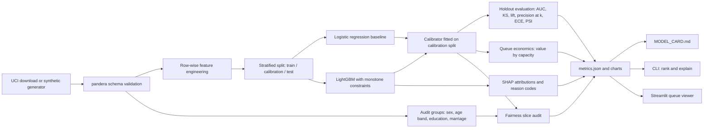

# credit-risk-explain


A collections or outreach team can only work a fraction of its accounts each cycle, and every
account it chooses has to be defensible. This repository ranks a credit work queue by calibrated
default risk, attaches adverse-action-style reason codes to every account, picks the queue size
from an explicit cost/benefit matrix, audits the ranking across protected groups, and writes the
model card from the same run. It is built on the public UCI "Default of Credit Card Clients"
dataset, with a seeded synthetic generator so everything runs offline in CI.

On the real UCI data (6,000-account stratified holdout), the monotone-constrained LightGBM ranker
reaches ROC-AUC 0.778 and captures 50.7% of next-month defaulters in the riskiest 20% of the
queue, against 48.2% for the logistic-regression baseline. Calibrated ECE is 0.010.
Full numbers are in [docs/MODEL_CARD.md](docs/MODEL_CARD.md).


## Quickstart

Requires Python 3.11+ and [uv](https://docs.astral.sh/uv/).

```bash
git clone https://github.com/seanmcrae/credit-risk-explain.git
cd credit-risk-explain
make install        # uv sync --all-extras
make demo           # train, rank and explain on the bundled synthetic sample
make app            # Streamlit queue viewer on http://localhost:8501
```

Real data (about 5 MB from UCI, checksum-verified, written to `data/raw/` and never committed):

```bash
make train-uci      # download, train, regenerate docs/MODEL_CARD.md and docs/img/
```

The CLI covers the rest of the workflow:

```bash
uv run credit-rank train    --data data/raw/uci_credit_default.csv --out artifacts/uci
uv run credit-rank evaluate --artifacts artifacts/uci                    # saved holdout metrics
uv run credit-rank evaluate --artifacts artifacts/uci --data new.csv     # score a labeled file, PSI vs holdout
uv run credit-rank rank     --artifacts artifacts/uci --capacity 1200    # writes queue.csv
uv run credit-rank explain 16555 --artifacts artifacts/uci --plot waterfall.png
uv run credit-rank model-card --artifacts artifacts/uci --out docs/MODEL_CARD.md --img-dir img
```

`docker build -t credit-risk-explain . && docker run -p 8501:8501 credit-risk-explain` trains on
the synthetic sample at build time and serves the app.

## Example output

`make demo`, captured verbatim. These numbers are from the bundled **synthetic** sample and say
nothing about real-world performance:

```text
$ make demo
Data: bundled synthetic sample (5,000 rows)  rows=5,000  default rate=21.9%
Holdout: 1,000 accounts. Champion: LightGBM
LightGBM             AUC=0.778  PR-AUC=0.550  KS=0.418  lift@D1=3.20  ECE=0.029
                     P@1%=0.700  P@5%=0.760  P@10%=0.700  P@20%=0.555
Logistic regression  AUC=0.786  PR-AUC=0.569  KS=0.460  lift@D1=3.29  ECE=0.028
                     P@1%=0.800  P@5%=0.780  P@10%=0.720  P@20%=0.550
Expected value @ 200 accounts: 32,400   value-maximizing capacity: 600 (60.0%) -> 40,800
Score PSI train vs holdout: 0.0049
Artifacts in artifacts/demo
Queue of 50 of 1,000 accounts -> artifacts/demo/queue.csv
 rank   id  probability  decile    reason_codes                                  primary_reason
    1 2185        0.800       1 R05;R01;R03;R02 Payments are small relative to the balance owed
    2 2165        0.800       1 R05;R01;R03;R02 Payments are small relative to the balance owed
    3 3081        0.800       1 R05;R01;R03;R02 Payments are small relative to the balance owed
    4 3813        0.800       1 R05;R01;R03;R02 Payments are small relative to the balance owed
    5 3153        0.765       1 R05;R01;R03;R02 Payments are small relative to the balance owed
Account 2185: P(default)=0.800  decile=1
Reasons:
  R05 Payments are small relative to the balance owed  [payment_to_limit_mean=0.00, +1.66]
  R01 Most recent payment is past due  [pay_status_recent=4.00, +1.01]
  R03 Balance is high relative to credit limit  [utilization_recent=0.90, +0.75]
  R02 Repeated or ongoing delinquency in the last six months  [delinquency_streak=6.00, +0.42]
Largest contributions (log-odds):
  +0.958  Repayment status last month (k = months late) = 4.00
  +0.907  Last statement balance divided by credit limit = 0.90
  +0.724  Average payment divided by credit limit = 0.00
  +0.527  Average payment as a share of the prior statement balance = 0.00
  +0.405  Last payment as a share of the prior statement balance = 0.00
  -0.396  Average six-month balance-to-limit ratio = 0.92
```

The same commands on the real UCI data (`make train-uci`):

| Holdout metric (UCI, 6,000 accounts) | LightGBM (champion) | Logistic regression |
|---|---|---|
| ROC-AUC | 0.778 | 0.738 |
| PR-AUC | 0.557 | 0.504 |
| KS | 0.429 | 0.387 |
| Precision in top 5% of queue | 77.0% | 70.7% |
| Defaulters captured in top 20% | 50.7% | 48.2% |
| Calibrated ECE | 0.010 | 0.009 |
| Expected value at 20% capacity (illustrative economics) | 197,200 | 184,000 |

| Cumulative capture | Reliability |
|---|---|
|  |  |

| SHAP summary | Expected value by queue size |
|---|---|
|  |  |

## Architecture



| Module | Responsibility |
|---|---|
| `schema.py`, `data.py`, `download.py` | Canonical columns, pandera validation, UCI download with SHA-256 check, audit-group decoding |
| `synthetic.py` | Seeded synthetic accounts with the same schema |
| `features.py` | 14 leakage-safe features; protected attributes excluded by construction |
| `models.py` | Stratified split, both models, Laplace-smoothed isotonic or Platt calibration |
| `metrics.py`, `evaluation.py` | KS, lift and capture, precision@k, expected value curve, ECE, PSI |
| `explain.py` | TreeSHAP / linear SHAP and grouped reason codes |
| `fairness.py` | Per-group priority rate, TPR/FPR at capacity, calibration gap, slice AUC |
| `queue.py` | Saved model bundle, queue building, single-account explanations |
| `pipeline.py`, `model_card.py`, `plots.py`, `cli.py` | Orchestration, generated model card, charts, typer CLI |

## Design decisions

- **Rank on the raw score, report the calibrated probability.** Isotonic calibration is a step
  function, so ranking on it would tie large blocks at the top of the queue (on the UCI holdout the
  top calibrated level, 0.861, covers 61 accounts). The raw score orders the queue; the calibrated
  probability feeds display, expected value and calibration audits. Deciles are cut on holdout
  scores and stored in the bundle, so "decile 1" means the same thing in every scoring batch.
- **Smoothed isotonic calibration.** Plain isotonic regression returns exactly 1.0 for a small
  pure block at the top. Each block's level is `(defaults + 1) / (accounts + 2)` instead, which
  leaves large blocks unchanged and stops the queue from claiming certainty.
- **Monotone constraints on the risk drivers an analyst would defend** (months late, delinquency
  counts, utilization, missed payments up; payment ratio down). On the UCI run they cost nothing:
  AUC 0.778 with eight constraints against 0.777 with six. They also remove explanations such as
  "an older late payment lowered risk" that come from collinear delinquency features.
- **Reason codes group correlated features.** Three utilization features would otherwise split
  credit and crowd out other reasons. Groups are netted, and only groups that raise risk are
  returned, matching what an adverse-action reason has to explain.
- **Capacity is a decision, not a parameter.** The expected-value curve is computed from realized
  holdout outcomes under the configured contact cost, loss given default and cure rate. Those
  figures are illustrative and live in `configs/default.yaml`.
- **Protected attributes are audit-only.** They never enter `features.py`, and a test flips sex and
  age on scored accounts to confirm probabilities do not move. The audit reports selection-rate
  and error-rate parity side by side, because being prioritized can be a burden (collections
  contact) or a benefit (hardship outreach) depending on the program.
- **Stratified, not out-of-time, split.** The source is one six-month snapshot with no time axis.
  The PSI check and `evaluate --data` are where an out-of-time sample would plug in.

## Data

- **Real:** [UCI Machine Learning Repository, Default of Credit Card Clients](https://archive.ics.uci.edu/dataset/350/default+of+credit+card+clients),
  30,000 Taiwanese card holders, April-September 2005, licensed CC BY 4.0. Cite: Yeh, I. C., &
  Lien, C. H. (2009). The comparisons of data mining techniques for the predictive accuracy of
  probability of default of credit card clients. *Expert Systems with Applications*, 36(2),
  2473-2480. `scripts/download_uci.py` verifies the archive's SHA-256 and writes
  `data/raw/uci_credit_default.csv`, which is git-ignored.
- **Synthetic:** `data/sample/synthetic_credit_5k.csv` is 5,000 **synthetic** accounts from
  `generate_synthetic(5000, seed=7)`. Relationships are hand-specified to be plausible, not fitted
  to the real data. Tests and CI use synthetic data only; no test touches the network.

## Limitations

- One 2005 snapshot from one market: no out-of-time validation, seasonality or drift, and no
  claim that the model transfers to another portfolio.
- The target is next-month default. The queue ranks who is likely to default, not who will
  respond to contact; an uplift model would be the right target for outreach.
- The economics are placeholders and drive the recommended capacity.
- On the UCI holdout, defaulters aged 18-24 are prioritized at 60.6% versus 42.6% for 55+ at 20%
  capacity. The model card's proxy screen traces it mainly to credit limit (+0.164 log-odds for
  18-24 defaulters relative to 55+) and recent payment status (+0.088), partly offset by
  utilization (-0.173). The repository measures the gap; it does not apply a mitigation.
- Reason codes explain the model, not the customer's situation, and are not legal adverse-action
  notices.

## Roadmap

Product framing, success metrics and the now/next/later roadmap (drift monitoring,
champion/challenger, uplift) are in [docs/PRODUCT.md](docs/PRODUCT.md).

## License

MIT, see [LICENSE](LICENSE). The UCI dataset is CC BY 4.0 and is not redistributed here.
