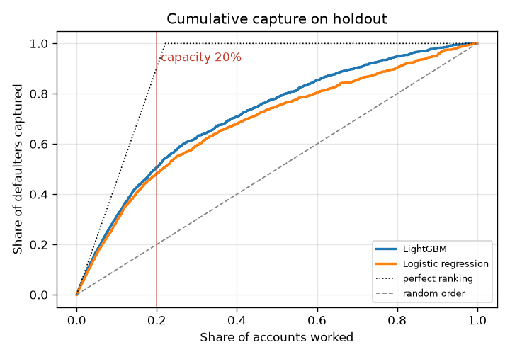
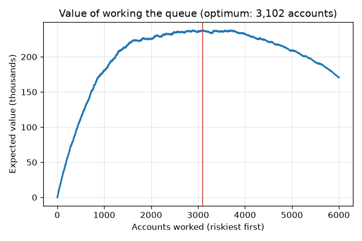
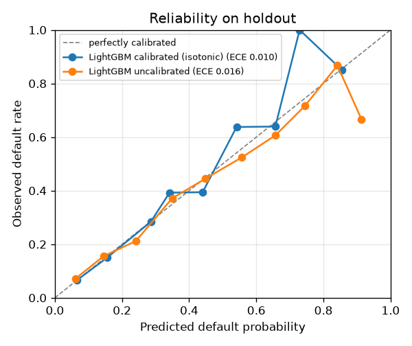
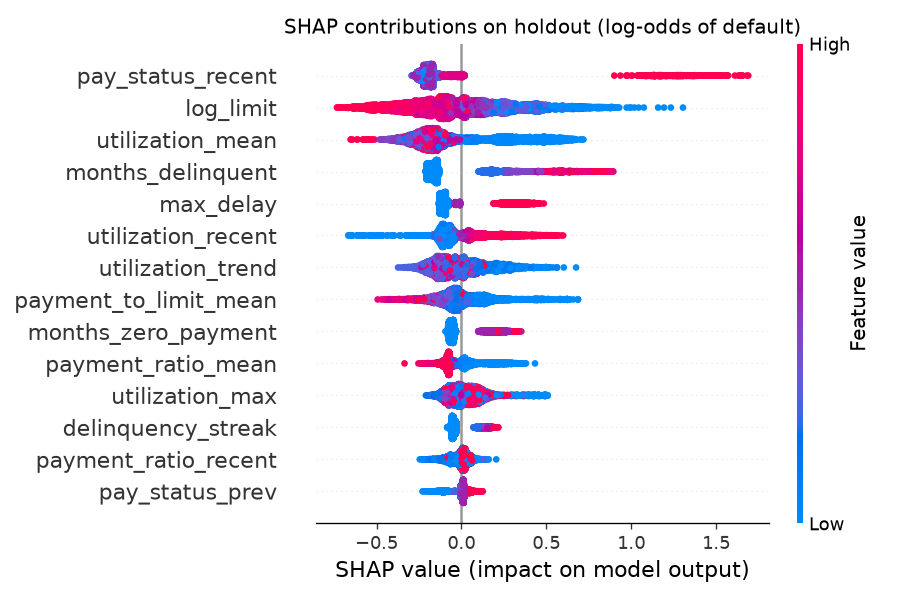
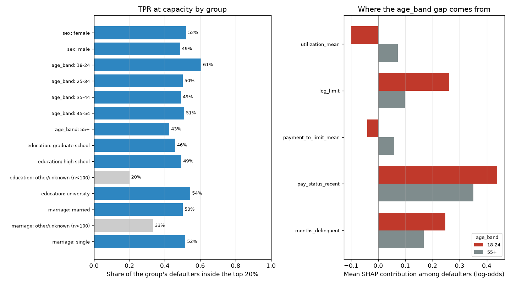

# Model card: explainable credit work-queue ranker

Generated by `credit-rank model-card` from the training run on **UCI Default of Credit Card Clients (30,000 rows)**. Every number below is computed by the code in this repository on that data. Source: UCI Machine Learning Repository, "Default of Credit Card Clients" (Yeh & Lien, 2009), CC BY 4.0. Taiwanese card holders, April-September 2005.

## Model details

- Champion: **LightGBM** with isotonic calibration. Challenger: Logistic regression.
- Monotonic constraints on LightGBM: on (`pay_status_recent` increasing, `pay_status_prev` increasing, `delinquency_streak` increasing, `months_delinquent` increasing, `max_delay` increasing, `utilization_recent` increasing, `months_zero_payment` increasing, `payment_ratio_mean` decreasing).
- Output per account: calibrated probability of default next month, a risk decile referenced to the holdout population, and up to 4 reason codes. The queue is ordered by the raw model score.
- Seed 42; the full configuration is stored in the run's `metrics.json`.

## Intended use

- Ordering a capacity-limited work queue (collections or proactive outreach) so analysts contact the accounts most likely to default first, with a stated reason for each.
- Choosing queue capacity by comparing expected value at different staffing levels.
- Methodology demonstration on public data.

Out of scope: credit approval or limit decisions, pricing, any automated action against a customer without human review, and populations unlike the training data.

## Data

| Item | Value |
|---|---|
| Dataset | UCI Default of Credit Card Clients (30,000 rows) |
| Rows | 30,000 |
| Default rate | 22.1% |
| Split (train / calibration / test) | 19,500 / 4,500 / 6,000, stratified |

The source is a single six-month snapshot, so the split is stratified rather than out-of-time.

### Features and exclusions

14 engineered features, each a row-wise function of the account's own six-month history (no target encoding, no dataset-level statistics):

| Feature | Meaning |
|---|---|
| `log_limit` | Log of the credit limit |
| `pay_status_recent` | Repayment status last month (k = months late) |
| `pay_status_prev` | Repayment status two months ago |
| `months_delinquent` | Months out of six with a late payment |
| `delinquency_streak` | Consecutive late months ending last month |
| `max_delay` | Longest delay in months over the six-month window |
| `utilization_recent` | Last statement balance divided by credit limit |
| `utilization_mean` | Average six-month balance-to-limit ratio |
| `utilization_max` | Peak six-month balance-to-limit ratio |
| `utilization_trend` | Change in balance-to-limit ratio over six months |
| `payment_ratio_recent` | Last payment as a share of the prior statement balance |
| `payment_ratio_mean` | Average payment as a share of the prior statement balance |
| `months_zero_payment` | Months with a balance due but no payment |
| `payment_to_limit_mean` | Average payment divided by credit limit |

Protected or sensitive attributes (`sex`, `age`, `education`, `marriage`) are excluded from the features and used only for the fairness audit. Excluding them does not rule out proxy effects through correlated features such as the credit limit.

## Performance on the holdout set

| Metric | LightGBM | Logistic regression |
|---|---|---|
| ROC-AUC | 0.778 | 0.738 |
| PR-AUC | 0.557 | 0.504 |
| KS | 0.429 | 0.387 |
| Top-decile lift | 3.13 | 2.93 |
| Brier score (calibrated) | 0.135 | 0.143 |
| ECE (calibrated) | 0.010 | 0.009 |
| ECE (uncalibrated) | 0.016 | 0.016 |
| Precision @ top 1% | 86.7% | 75.0% |
| Precision @ top 5% | 77.0% | 70.7% |
| Precision @ top 10% | 69.2% | 64.8% |
| Precision @ top 20% | 56.1% | 53.3% |

### Lift by decile (LightGBM)

| Decile | Accounts | Defaults | Default rate | Lift | Cum. capture |
|---|---|---|---|---|---|
| 1 | 600 | 415 | 69.2% | 3.13 | 31.3% |
| 2 | 600 | 258 | 43.0% | 1.94 | 50.7% |
| 3 | 600 | 158 | 26.3% | 1.19 | 62.6% |
| 4 | 600 | 109 | 18.2% | 0.82 | 70.8% |
| 5 | 600 | 101 | 16.8% | 0.76 | 78.4% |
| 6 | 600 | 91 | 15.2% | 0.69 | 85.3% |
| 7 | 600 | 67 | 11.2% | 0.50 | 90.4% |
| 8 | 600 | 60 | 10.0% | 0.45 | 94.9% |
| 9 | 600 | 44 | 7.3% | 0.33 | 98.2% |
| 10 | 600 | 24 | 4.0% | 0.18 | 100.0% |

## Queue economics (illustrative)

Assumptions from config, not real figures: cost per contact 60, loss given default 4,000, share of defaulters a contact prevents 10%. Working an account pays off above a default probability of 0.150.

| Quantity | Value |
|---|---|
| Expected value at 20% capacity (1,200 accounts) | 197,200 |
| Value-maximizing capacity | 3,102 accounts (51.7% of holdout) |
| Expected value at that capacity | 237,880 |
| Expected value if every account is worked | 170,800 |

## Calibration

The isotonic calibrator is fitted on a separate calibration split. Holdout ECE is 0.010 after calibration and 0.016 before.

## Explainability

SHAP values in log-odds space: exact TreeSHAP for LightGBM, exact linear SHAP for logistic regression. Top global drivers by mean absolute SHAP:

| Feature | Mean abs SHAP |
|---|---|
| `pay_status_recent` | 0.294 |
| `log_limit` | 0.246 |
| `utilization_mean` | 0.242 |
| `months_delinquent` | 0.237 |
| `max_delay` | 0.161 |
| `utilization_recent` | 0.125 |
| `utilization_trend` | 0.124 |
| `payment_to_limit_mean` | 0.111 |

Reason codes group related features and report only groups that raise the account's risk:

| Code | Reason | Features |
|---|---|---|
| R01 | Most recent payment is past due | `pay_status_recent`, `pay_status_prev` |
| R02 | Repeated or ongoing delinquency in the last six months | `months_delinquent`, `delinquency_streak`, `max_delay` |
| R03 | Balance is high relative to credit limit | `utilization_recent`, `utilization_mean`, `utilization_max` |
| R04 | Balance has been increasing | `utilization_trend` |
| R05 | Payments are small relative to the balance owed | `payment_ratio_recent`, `payment_ratio_mean`, `payment_to_limit_mean` |
| R06 | Balance due with no payment made | `months_zero_payment` |
| R07 | Limited credit line | `log_limit` |

## Fairness audit

Priority means the account falls inside the top 20% of the holdout queue. Priority-rate ratio is the lowest group priority rate divided by the highest; TPR gap is the spread in the share of each group's defaulters that get prioritized. Slices under 100 accounts are flagged and left out of the summary. Being worked can be a burden (collections contact) or a benefit (early hardship help), so both selection parity and error-rate parity are reported.

| Attribute | Priority-rate ratio | TPR gap | FPR gap | Max abs calibration gap |
|---|---|---|---|---|
| age_band | 0.65 | 0.180 | 0.077 | 0.029 |
| education | 0.67 | 0.085 | 0.053 | 0.008 |
| marriage | 0.95 | 0.015 | 0.002 | 0.023 |
| sex | 0.94 | 0.036 | 0.016 | 0.011 |

| Attribute | Group | Accounts | Default rate | Priority rate | TPR @ capacity | Calibration gap | AUC | Small slice |
|---|---|---|---|---|---|---|---|---|
| sex | female | 3,598 | 21.3% | 19.5% | 52.2% | +0.011 | 0.780 |  |
| sex | male | 2,402 | 23.4% | 20.8% | 48.7% | -0.000 | 0.773 |  |
| age_band | 18-24 | 541 | 25.3% | 28.7% | 60.6% | +0.029 | 0.777 |  |
| age_band | 25-34 | 2,518 | 20.1% | 18.5% | 50.1% | +0.015 | 0.787 |  |
| age_band | 35-44 | 1,855 | 22.5% | 18.9% | 49.2% | -0.003 | 0.769 |  |
| age_band | 45-54 | 859 | 24.7% | 21.5% | 50.9% | -0.012 | 0.771 |  |
| age_band | 55+ | 227 | 23.8% | 18.5% | 42.6% | -0.002 | 0.784 |  |
| education | graduate school | 2,130 | 19.0% | 15.4% | 45.9% | +0.008 | 0.792 |  |
| education | high school | 1,014 | 25.7% | 22.8% | 49.4% | -0.008 | 0.734 |  |
| education | other/unknown | 82 | 6.1% | 6.1% | 20.0% | +0.099 | 0.551 | yes |
| education | university | 2,774 | 23.6% | 22.9% | 54.4% | +0.007 | 0.780 |  |
| marriage | married | 2,767 | 24.1% | 20.5% | 50.1% | -0.014 | 0.780 |  |
| marriage | other/unknown | 75 | 16.0% | 17.3% | 33.3% | +0.072 | 0.679 | yes |
| marriage | single | 3,158 | 20.5% | 19.6% | 51.6% | +0.023 | 0.779 |  |

Differences in priority rate mostly follow differences in observed default rate. TPR, FPR and calibration gaps are the signals that equally risky accounts are treated differently. On this run the largest TPR gap is on `age_band`: 60.6% of defaulters in `18-24` are prioritized versus 42.6% for `55+`.

### Where the largest gap comes from

Protected attributes are not model inputs, so a TPR gap has to travel through the features. The table compares the mean SHAP contribution (log-odds) among each group's defaulters for the features that differ most between `18-24` and `55+`. A positive difference moves `18-24` defaulters up the queue. This is a proxy screen, not a causal decomposition.

| Feature | `18-24` | `55+` | Difference |
|---|---|---|---|
| `utilization_mean` | -0.100 | +0.073 | -0.173 |
| `log_limit` | +0.261 | +0.098 | +0.164 |
| `payment_to_limit_mean` | -0.040 | +0.060 | -0.100 |
| `pay_status_recent` | +0.439 | +0.351 | +0.088 |

## Stability

PSI of champion scores, training vs holdout: 0.002 (under 0.1 is conventionally stable). In production the same check runs between the development sample and each new scoring month.

## Limitations

- One 2005 Taiwanese snapshot: no time axis, so no out-of-time validation, seasonality or drift.
- The outcome is next-month default, not loss amount or recoverability. The queue ranks who is likely to default, not who responds to contact (uplift).
- The economic parameters are illustrative placeholders and drive the capacity recommendation.
- Undocumented education and marriage codes are pooled as other/unknown.
- Reason codes describe the model, not causes. They are adverse-action style, not legal notices.
